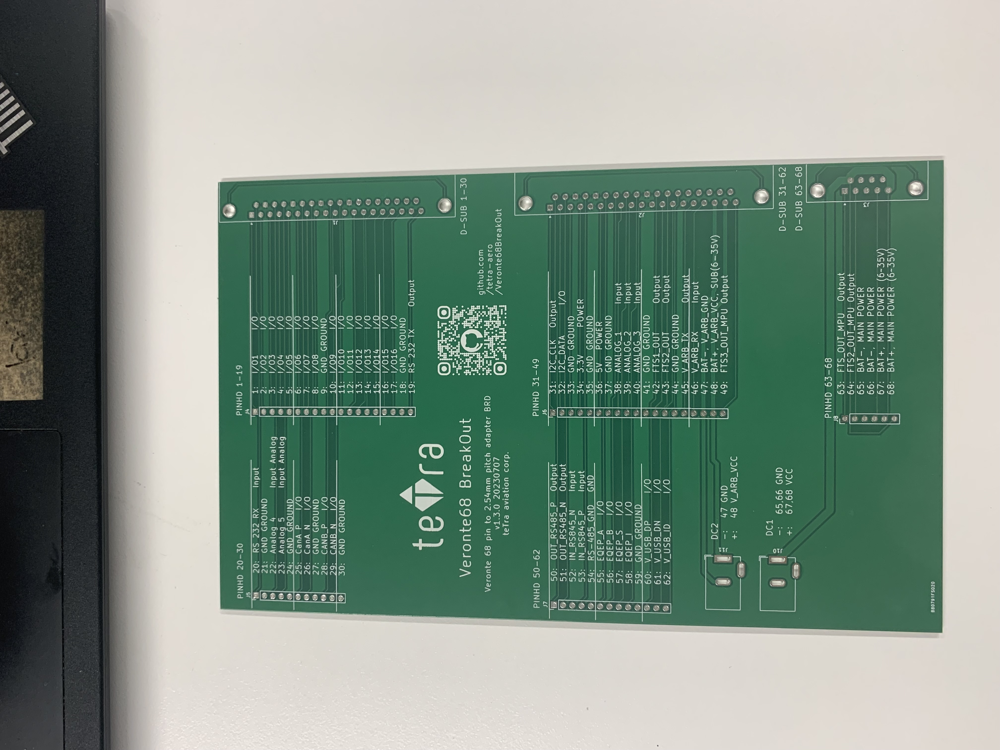
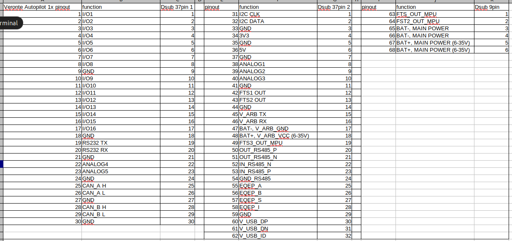

# Veronte68BreakOut
Embention Veronte Autopilot 1x, 68 pin to 2.54 pitch adapter board

## Veronte68 pinout

more information (internal): Log, make Veronte 68 pin to 2.54 pitch adapter board
https://www.notion.so/tetraaviation/Log-make-Veronte-68-pin-to-2-54-pitch-adapter-board-f0575a66330b4e21ac6df0196d4a23b4
